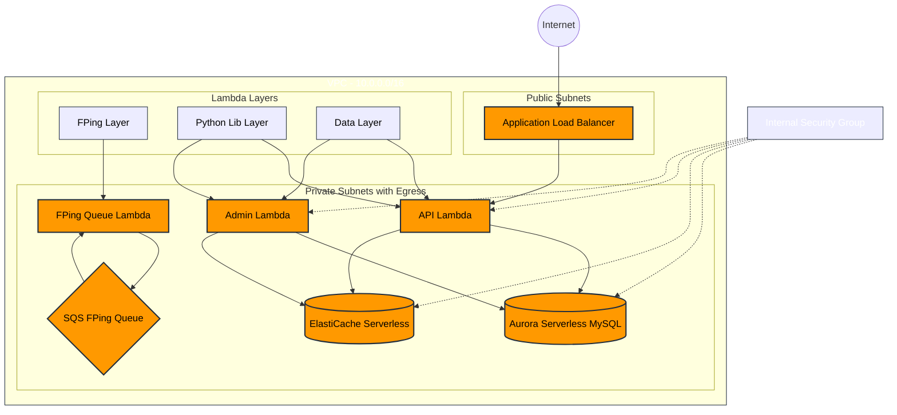

# CloudPerf Architecture

## Component Description

### Infrastructure
- **VPC**: Network with CIDR 10.0.0.0/16
- **Public Subnets**: Contains ALB for external access
- **Private Subnets**: Contains all compute and data resources
- **Security Group**: Controls internal resource access

### Compute Resources
- **API Lambda**: Handles external API requests
- **Admin Lambda**: Manages administrative operations
- **FPing Queue Lambda**: Processes network quality measurements

### Data Stores
- **Aurora Serverless**: MySQL compatible database
- **ElastiCache Serverless**: Redis cache for performance
- **SQS Queue**: Manages FPing measurement tasks

### Lambda Layers
- **FPing Layer**: Contains FPing executable
- **Python Lib Layer**: Common Python libraries
- **Data Layer**: Database and cache access layer

### Access Points
- **Application Load Balancer**: Entry point for API requests
